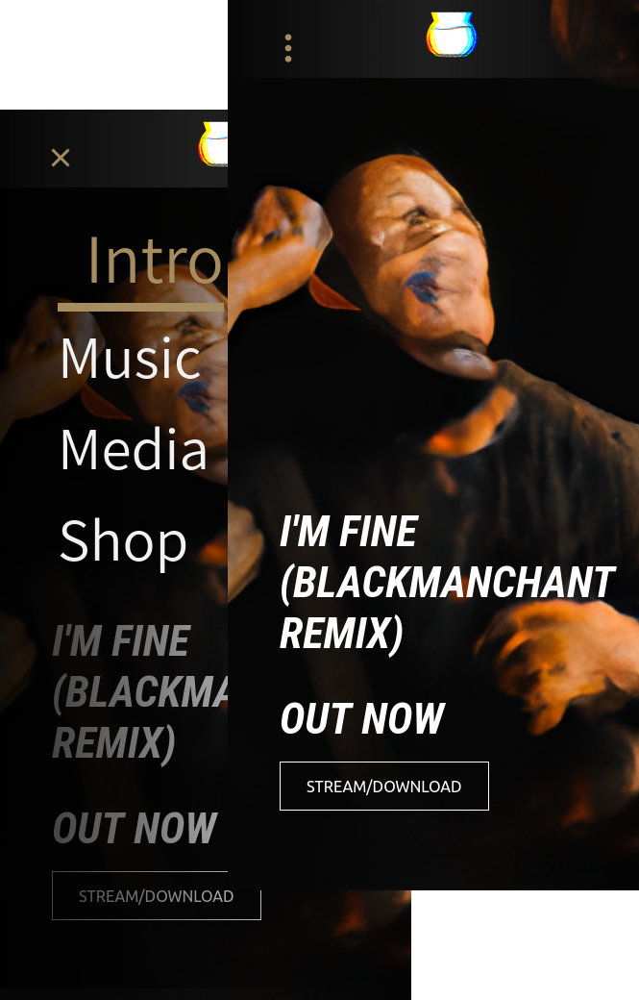
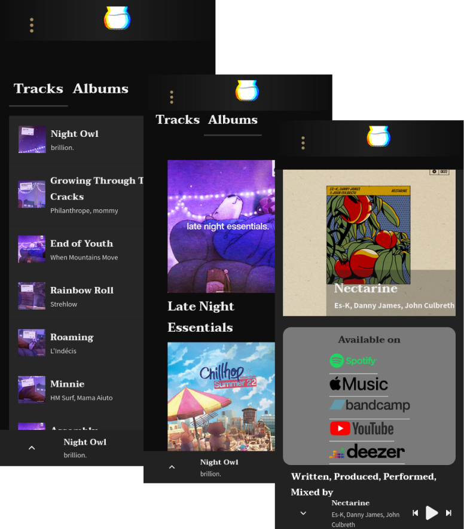
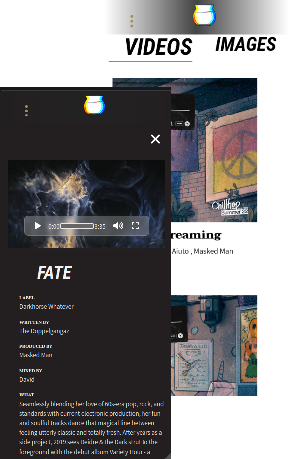
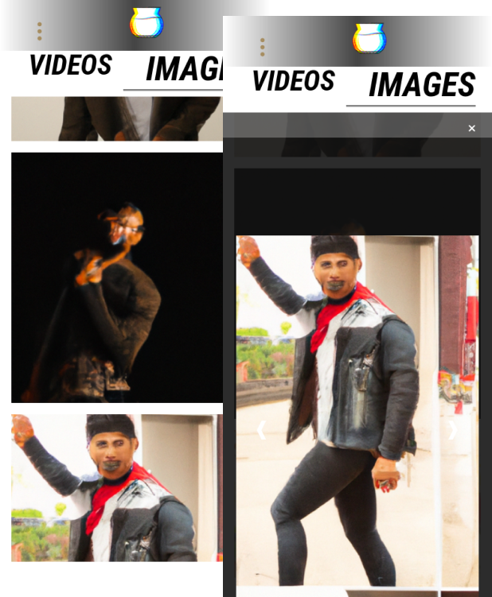
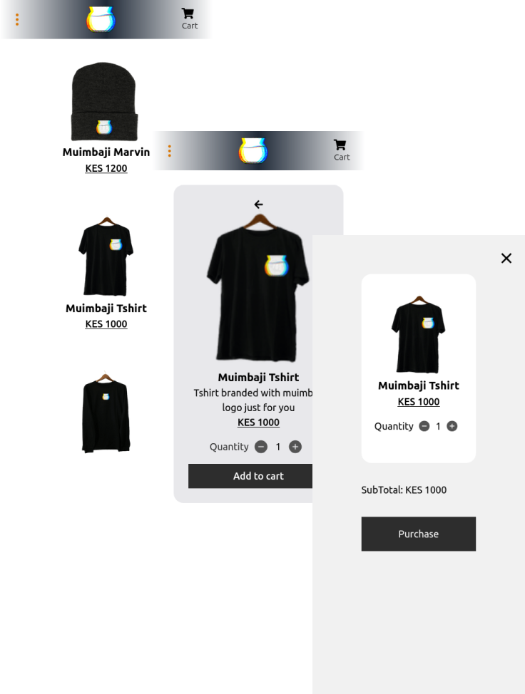

# Muimbaji

## Introduction

This project is a web app that showcases a music artist's work. It has four pages:

- **Intro:** Features the artist's latest work, an about section with information about the artist, and a section for upcoming events with dates and links.
    

    
    

- **Music:** Contains the artist's discography, including tracks and albums. Songs can be played using the custom audio player at the bottom of the page. More information about songs can be discovered by expanding the player.
    

    
    

- **Gallery:** Showcases music videos by the artist in the videos section and an image gallery with images related to the artist.
    

    
    

    

    
    

- **Shop:** Links to the Muimbaji store, an ecommerce page linked with Strapi that showcases merchandise on sale by the artist.
    

    
    

Check out the deployed site [here](https://muimbaji.vercel.app)

## Installation

Here are the steps to install this project:

1. Clone the repository: `git clone https://github.com/username/repository.git`
2. Navigate into the directory: `cd repository`
3. Install the dependencies: `npm install`

## Usage

In the project directory, you can run:

### `npm start`

Runs the app in the development mode.\
Open [http://localhost:3000](http://localhost:3000) to view it in your browser.

The page will reload when you make changes.\
You may also see any lint errors in the console.

### `npm test`

Launches the test runner in the interactive watch mode.\

### `npm run build`

Builds the app for production to the `build` folder.\
It correctly bundles React in production mode and optimizes the build for the best performance.

The build is minified and the filenames include the hashes.\
Your app is ready to be deployed!

## Related Projects

- [store](https://github.com/kei-en/store): Contains code that implements the eshop in this web app

## Author

- **Karanja J Njuguna** - <[kei-en](https://github.com/kei-en)>

## License

This project is licensed under the MIT License - see the [LICENSE](./LICENSE) file for details.

## Related Projects

- [store](https://github.com/kei-en/store): Contains code that implements the eshop in this web app

## Author

- **Karanja J Njuguna** - <[kei-en](https://github.com/kei-en)>

## License

This project is licensed under the MIT License - see the [LICENSE](./LICENSE) file for details.
